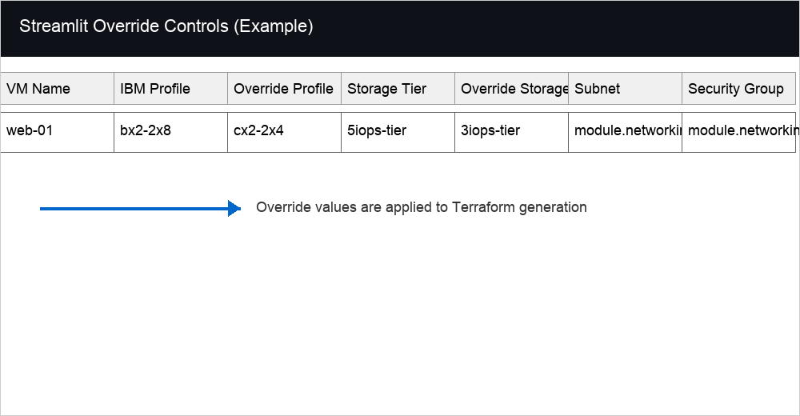
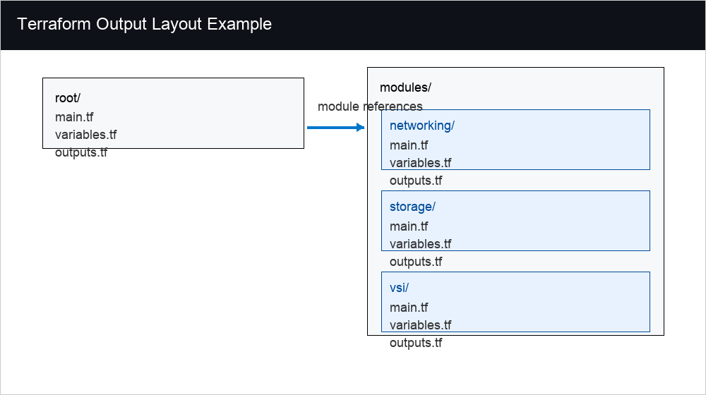

# RVTools to IBM Cloud VPC: Automated Infrastructure Mapping

## Overview
This utility automates the conversion of VMware RVTools exports into modular IBM Cloud VPC Terraform configurations. By correlating performance telemetry and networking metadata across multiple data tabs, the engine generates infrastructure-as-code (IaC) that reflects actual utilization requirements rather than static allocations.

## Core Functional Logic

### Network Schema Discovery
The tool identifies on-premises network configurations by correlating data from the vNetwork and vInfo tabs.
* **IP Range Mapping**: Extracts IPv4 gateways and addresses to define VPC Address Prefixes.
* **Subnet Generation**: Automatically configures subnets using a manual address preference, ensuring original CIDR blocks are preserved in the target VPC environment.
* **Resource Linking**: Maps individual Virtual Server Instances (VSIs) to their respective subnets based on on-premises port group assignments.
* **Multi-NIC Mapping**: Uses `vNetwork` rows to preserve primary and secondary NIC placement. Connected secondary NICs generate additional VSI network interfaces.

### Performance-Aware Right-Sizing
The mapping engine evaluates compute requirements by analyzing specific performance metrics to mitigate the risk of post-migration performance degradation.
* **Contention Analysis**: Monitors CPU Ready % and Co-Stop telemetry. If a workload shows signs of resource contention on-premises, the tool implements a "Safety Match" policy, maintaining the original core count and memory allocation.
* **Utilization Thresholds**: Allows for the application of variable utilization factors (30% to 70%) to align suggested IBM VPC profiles with specific performance targets.
* **Memory-Aware Sizing**: Uses `vMemory` active, consumed, ballooned, swapped, reservation, limit, and hot-add data to avoid unsafe reductions and provide conservative RAM recommendations.

### Resource Efficiency Auditing
The application performs an automated audit of the inventory to identify underutilized assets.
* **Identification of Low-Utilization Assets**: Workloads exhibiting <5% CPU utilization and <100 MHz overall demand are flagged for review.
* **Capacity Headroom (N+1)**: Calculates available cluster capacity by identifying the largest host speed and evaluating remaining aggregate capacity against total VM demand.

### Per-Disk Volume Mapping
The tool now preserves RVTools `vDisk` detail instead of collapsing all disks into one target volume.
* **Boot Disk Separation**: The first discovered disk is treated as image-covered boot storage.
* **Data Disk Volumes**: Additional disks generate IBM Cloud block volumes and VSI volume attachments.
* **Disk Handoff**: A `disk-mapping.csv` file shows source disk metadata and target Terraform volume/attachment names.

### Image Readiness Assessment
The dashboard evaluates source VM metadata for IBM Cloud VPC custom image planning.
* **Readiness Status**: Flags each workload as `Ready`, `Review`, or `Blocked`.
* **Image Constraints**: Checks boot disk size against IBM Cloud custom image limits and records the required `qcow2` or `vhd` conversion target.
* **Guest Preparation**: Identifies the expected guest customization path, such as `cloud-init` for Linux or `cloudbase-init` for Windows.

### Migration Readiness Assessment
The dashboard also evaluates operational migration prerequisites from optional RVTools tabs.
* **Snapshot Review**: Uses `vSnapshot` to flag active snapshots and block large snapshot footprints before export or replication.
* **Guest Health Signals**: Uses `vTools` to flag VMware Tools, heartbeat, application status, upgrade, and operation readiness concerns.
* **Attached Device Cleanup**: Uses `vCD` and `vUSB` to block connected ISO/CD media or USB device dependencies before migration.
* **Health Findings**: Uses `vHealth` where VM-level findings can be matched to the workload inventory.

### Memory Readiness Assessment
The dashboard evaluates memory pressure and sizing constraints from RVTools `vMemory`.
* **Pressure Detection**: Flags swapping and ballooning before profile reductions are applied.
* **Constraint Detection**: Captures reservations, memory limits, and hot-add dependencies for owner review.
* **Sizing Guidance**: Uses active memory with a conservative floor when memory can be reduced safely.

## Technical Structure
The application architecture is divided into four functional layers:
1. **Data Processing**: Utilizes Pandas for cross-tabulation and normalization of RVTools telemetry.
2. **Logic Engine**: Executes profile matching and storage tiering (3, 5, or 10 IOPS) based on workload characteristics.
3. **Template Rendering**: Outputs HCL (HashiCorp Configuration Language) in a modular format including networking, storage, and VSI modules.
4. **Migration Handoff**: Exports source-to-target mapping files that help migration teams connect generated Terraform to image import, replication, and cutover workflows.

## Data Requirements
Successful execution requires a standard RVTools XLSX export containing the following worksheets:
* **vInfo**: Primary inventory, power states, and network assignments.
* **vNetwork**: Networking metadata and IPv4 addressing.
* **vCPU**: Detailed performance telemetry (MHz, Ready %, Limits).
* **vMemory**: Memory telemetry for active, consumed, swapped, ballooned, reservation, limit, and hot-add data.
* **vHost / vCluster**: Physical infrastructure specifications and aggregate capacity.
* **vDisk**: Storage capacity and disk inventory.
* **vSnapshot / vTools / vCD / vUSB / vHealth**: Optional migration readiness signals for snapshots, guest tools, attached media, USB devices, and health warnings.

## Business Case and Mapping Output
The dashboard now includes a potential savings metric and exports an enriched business case CSV with per-VM data including:
* Baseline cost estimate
* Estimated monthly savings
* Subnet mapping for Terraform
* Security group mapping for Terraform (if enabled)
* User override fields for Profile and Storage Tier to influence generated Terraform
* Source metadata including IP address, guest OS, host, cluster, datacenter, and disk count for migration handoff planning
* Image readiness status, readiness reasons, firmware, boot disk size, and guest customization requirement
* Migration readiness status, readiness reasons, snapshot count/size, VMware Tools status, mounted media, USB device count, and health warning count
* Memory readiness status, pressure indicators, reservation/limit data, and sizing memory basis
* Per-disk boot/data role, capacity, source controller metadata, and target volume attachment mapping
* Per-NIC source network, IP, MAC, adapter, connected state, target subnet, and security group mapping

## Streamlit Override Controls
The Streamlit dashboard exposes editable override fields for `Override Profile` and `Override Storage Tier`. When set, these user-specified values are honored by the Terraform generator, allowing human-directed tuning of VSI sizing without changing the underlying migration logic.

### Example
If the auto-generated profile is `bx2-2x8` but you want the instance to use `cx2-2x4`, set `Override Profile` to `cx2-2x4` for that row before clicking **Build Terraform Project**. The generated VSI resource will then use the override profile.

If you want a lower-cost disk tier than the default recommendation, change `Override Storage Tier` from `5iops-tier` to `3iops-tier` for that row; the generated volume resource will then use the override tier.

### Override Columns
The Streamlit data table uses the following override columns:
* `Override Profile` — choose an alternate IBM Cloud VSI profile
* `Override Storage Tier` — choose an alternate storage IOPS tier
* `Subnet` — displays the generated subnet mapping for the selected network
* `Security Group` — displays the generated security group mapping when enabled

### Terraform Overrides & Deployment Targets
The `Terraform Overrides` expander exposes additional infrastructure configuration controls:
* **VPC Name** — name the target IBM Cloud VPC resource
* **Address Prefix Strategy** — choose `manual` to preserve generated CIDR prefixes, or `auto` to use provider-managed allocation
* **Custom CIDR per Subnet** — override the generated subnet CIDR for each discovered network
* **Deployment Target** — choose `Plain CLI` for local Terraform execution, or `IBM Schematics` for Schematics-managed deployment

When `Plain CLI` is selected, the generated root `main.tf` uses a local Terraform backend configuration. For `IBM Schematics`, the bundle omits the backend block so Schematics can manage state.

> Best practice: only set override values when you have validated that the target IBM Cloud profile and tier are supported for the workload and its storage requirements.

## Terraform Output Structure
The exported ZIP bundle now produces a modular Terraform layout:
* `main.tf`, `variables.tf`, `outputs.tf` at the root
* `modules/networking/main.tf`, `variables.tf`, `outputs.tf`
* `modules/storage/main.tf`, `variables.tf`, `outputs.tf`
* `modules/vsi/main.tf`, `variables.tf`, `outputs.tf`

## Migration Handoff Package
Each ZIP bundle also includes a migration handoff package that bridges generated Terraform with image migration and cutover activities:
* `migration-manifest.json` — tool-neutral source-to-target mapping for each VM
* `vm-mapping.csv` — spreadsheet-friendly view for migration planning and customer review
* `nic-mapping.csv` — per-NIC primary/secondary network interface mapping
* `disk-mapping.csv` — per-disk boot/data mapping for volume creation and attachment review
* `memory-readiness.csv` — VM-level memory pressure, constraint, and sizing review
* `readiness-findings.csv` — row-level migration readiness findings and remediation actions
* `image-import-variables.tfvars.example` — placeholder map for IBM Cloud VPC custom image IDs after image import
* `migration-runbook.md` — operational runbook for image staging, Terraform apply, validation, and cutover

The handoff files include image readiness, migration readiness, memory readiness, NIC mapping, and disk mapping fields so migration teams can resolve boot image, snapshot, mounted media, guest tools, memory pressure, reservations, limits, network, data disk, firmware, OS, and guest customization concerns before import. They are intentionally tool-neutral and can be reviewed by migration teams, adapted for RackWare or other migration tooling, or used as input for a migration factory workflow.

Generated resources include standardized naming and tags for project and management metadata, and the networking module exports reusable `subnet_id` and `security_group_id` outputs for the VSI module.

## Execution
1. Install dependencies: `pip install -r requirements.txt`
2. Launch the utility: `streamlit run app.py`
3. Upload the RVTools .xlsx file.
4. Review the generated business case, savings metrics, and network/security mappings.
5. Download the Terraform Bundle (ZIP) for deployment via IBM Cloud CLI or IBM Cloud Schematics.
6. Review the included migration handoff files before image import, replication, or cutover planning.

## User Manual
For a complete searchable guide to installation, RVTools inputs, web interface fields, dashboard metrics, readiness statuses, generated Terraform, ZIP contents, handoff files, troubleshooting, and glossary terms, see `docs/user-manual.md`.

## Further Reading
Start with `docs/user-manual.md` for end-user operation. For detailed Terraform override behavior and deployment target guidance, see `docs/terraform-overrides.md`. For migration handoff package details, see `docs/migration-handoff-package.md`. For image readiness guidance, see `docs/image-readiness-assessment.md`. For broader migration readiness guidance, see `docs/migration-readiness-assessment.md`. For memory readiness and sizing guidance, see `docs/memory-readiness-sizing.md`.

## Release Notes
- Added a potential savings metric to the Streamlit dashboard.
- Added per-VM baseline and savings values in the exported business case CSV.
- Added subnet and security group mapping fields to the business case export to support Terraform wiring.
- Added Terraform override controls for VPC naming, prefix strategy, custom CIDRs, and deployment target selection.
- Added migration handoff files for source-to-target mapping, image import placeholders, and cutover runbook support.
- Added image readiness assessment fields for IBM Cloud VPC custom image planning.
- Added per-disk data volume generation, VSI volume attachments, and `disk-mapping.csv`.
- Added multi-NIC network mapping, secondary VSI network interfaces, and `nic-mapping.csv`.
- Added migration readiness assessment from RVTools snapshot, tools, CD, USB, and health tabs, including `readiness-findings.csv`.
- Added a comprehensive searchable user manual in `docs/user-manual.md`.
- Added memory readiness and conservative RAM sizing using RVTools `vMemory`, including `memory-readiness.csv`.

---
**Author**: Michael Vincent Jones
**Version**: 1.7.0
