# Carbon UI Integration Architecture Diagrams

This document provides visual representations of the Carbon UI integration architecture, data flows, and component interactions.

---

## 1. System Architecture Overview

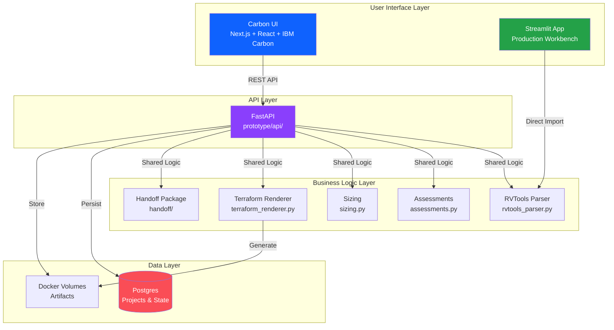

---

## 2. Network Planning Data Flow

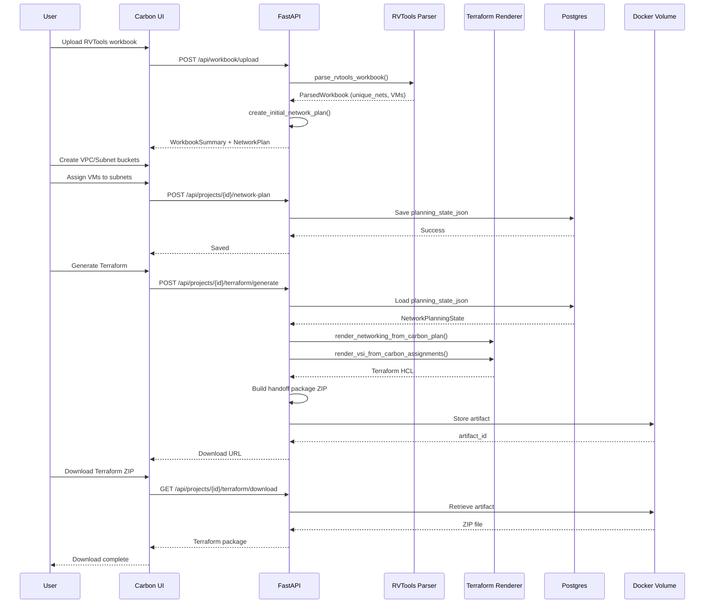

---

## 3. Network Planning Schema Relationships

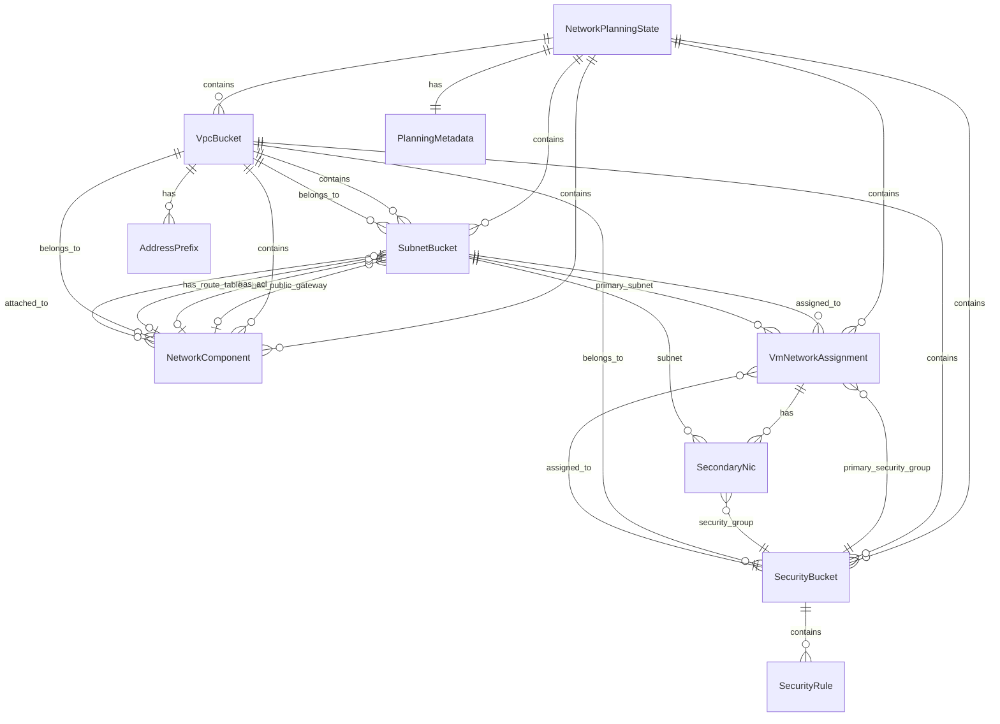

---

## 4. Drag-and-Drop Assignment Flow

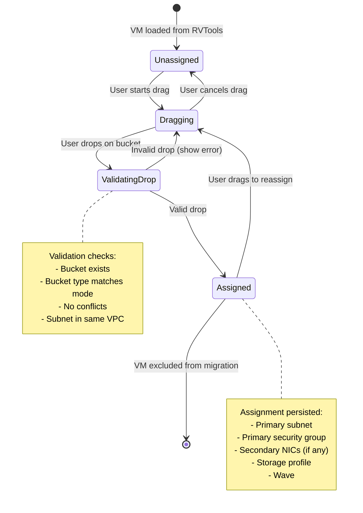

---

## 5. Terraform Generation Pipeline

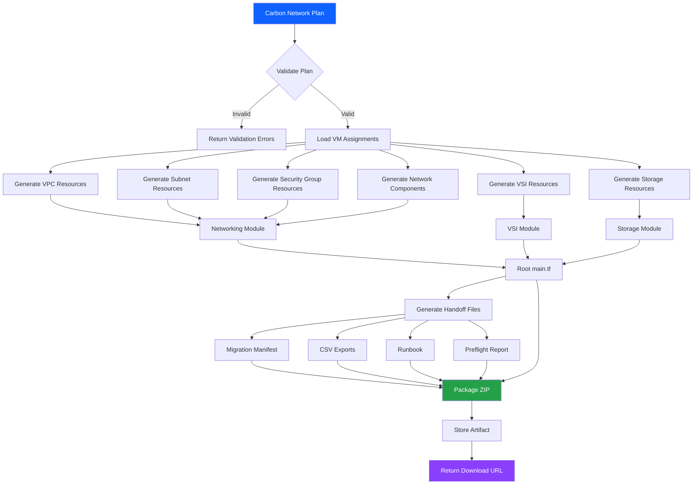

---

## 6. Component Interaction: VM Assignment

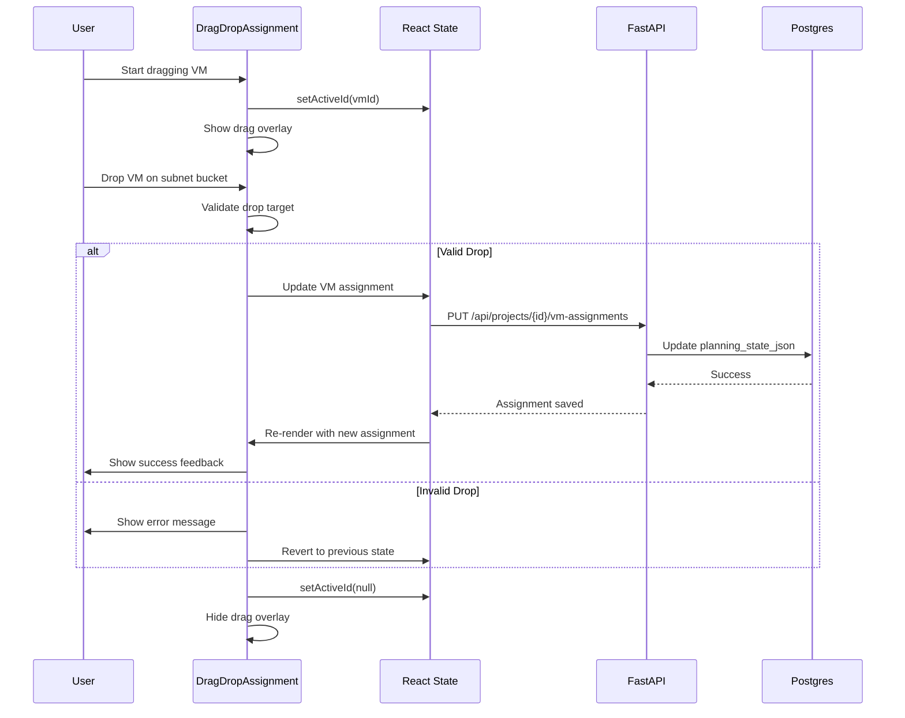

---

## 7. Feature Parity Progress Tracking

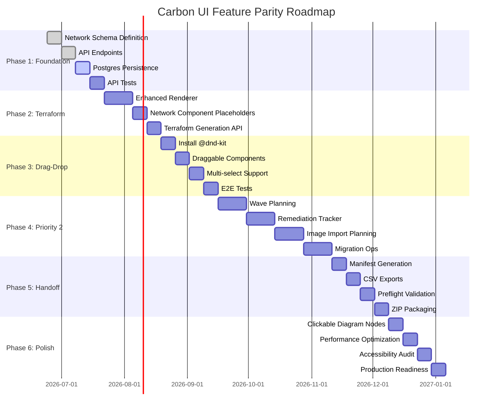

---

## 8. Promotion Gates Decision Tree

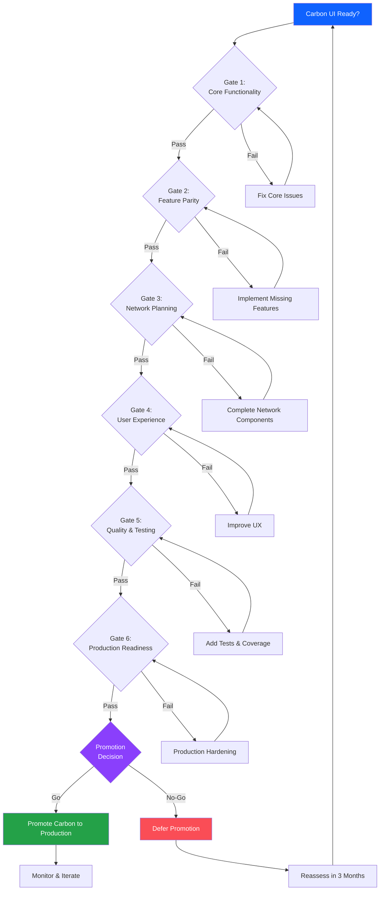

---

## 9. Data Model: Network Planning State

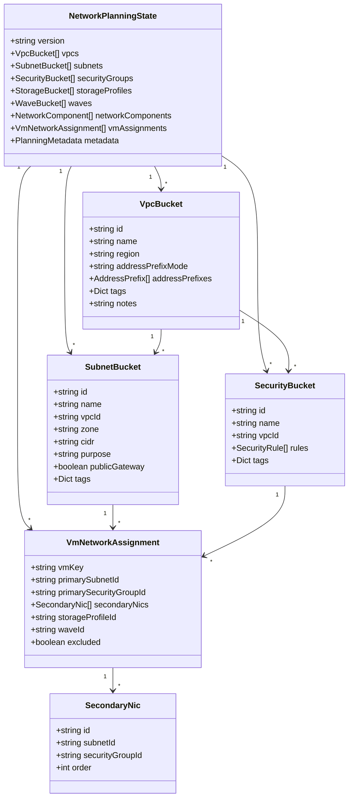

---

## 10. Backward Compatibility Strategy

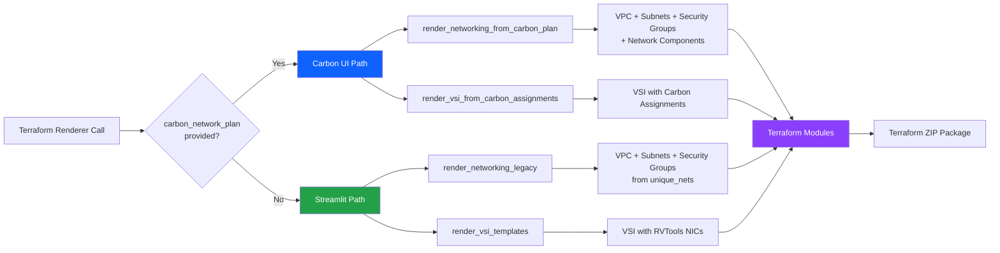

---

## 11. API Endpoint Map

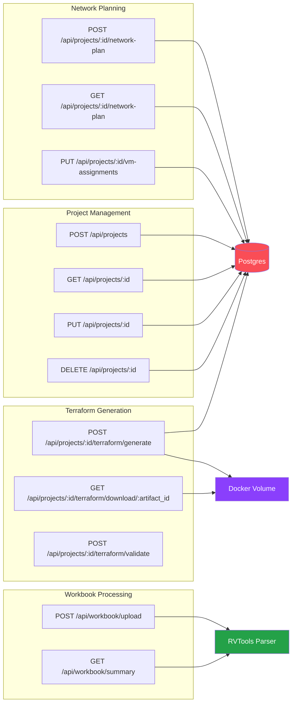

---

## 12. Testing Strategy Pyramid

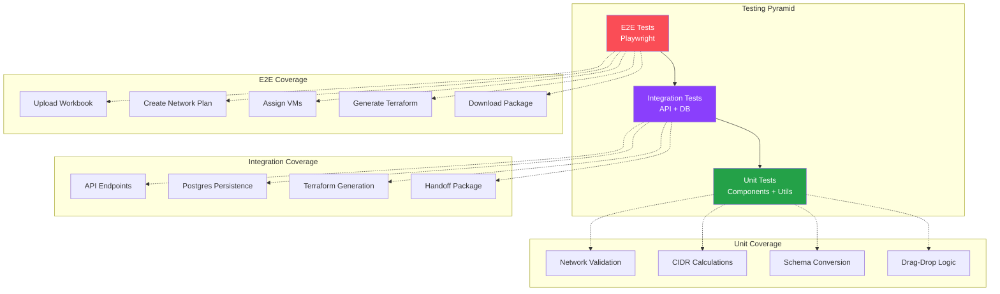

---

**Document Version**: 1.0
**Last Updated**: 2026-06-23
**Status**: Planning Phase
